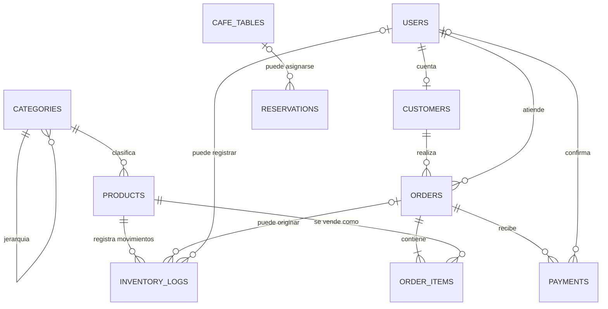

# Informe de estructura de la base de datos

## Propósito y alcance

Este informe describe la estructura definida por la capa activa de migraciones del proyecto Raíz & Grano. La fuente revisada es `database/migrations/2026_10_09_000001_consolidated_core_schema.php`, junto con la migración de datos demo. Por tanto, documenta el esquema que el código intenta crear; no certifica que una base de datos existente haya sido migrada ni que sus datos sean reales o estén completos.

La migración consolidada define 20 tablas: 12 tablas de operación del negocio y 8 tablas de autenticación, sesiones, caché y colas de Laravel.

## Organización por áreas

### Catálogo e inventario

- `categories`: categorías jerárquicas; `parent_id` puede apuntar a otra categoría.
- `products`: productos asociados a una categoría, con precio, costo opcional, existencias, disponibilidad por canal y borrado lógico.
- `inventory_logs`: movimientos de inventario vinculados a un producto; puede registrar pedido y usuario relacionados, además de existencias antes y después del movimiento.

### Clientes, pedidos y cobros

- `customers`: perfil de cliente opcionalmente vinculado a una cuenta de `users`; incluye datos de contacto y puntos de fidelidad.
- `orders`: cabecera del pedido, canal (`pos` o `ecommerce`), estados, importes, método y estado del pago, datos de atención y marcas de tiempo operativas.
- `order_items`: líneas del pedido vinculadas a `orders` y `products`. También contiene copias opcionales del nombre y SKU, y el precio y subtotal de venta.
- `payments`: registros de cobro asociados a un pedido, con importe, moneda, método, estado, referencia, proveedor y usuario que confirma.

### Reservas y atención

- `cafe_tables`: mesas con código, zona, capacidad, estado, coordenadas del plano y disponibilidad administrativa.
- `reservations`: datos de contacto, fecha, hora, cantidad de personas, zona, estado y mesa opcional.
- `contact_messages`: mensajes recibidos, datos de contacto y estado de atención.

### Contenido y configuración

- `settings`: valores de configuración agrupados por clave y tipo.
- `gallery_items`: contenido de galería con categoría, URL de imagen, orden y estado activo.

### Infraestructura de Laravel

- `users`: cuentas, correo único, contraseña, rol (`admin` o `customer`) y marcas de tiempo.
- `password_reset_tokens`: tokens de recuperación por correo.
- `sessions`: sesiones de usuario.
- `cache` y `cache_locks`: almacenamiento de caché y bloqueos.
- `jobs`, `job_batches` y `failed_jobs`: ejecución, agrupación y registro de trabajos en cola.

## Relaciones principales

Las relaciones de pedidos con cliente y de reservas con mesa son opcionales según el esquema. Las líneas de pedido requieren un producto existente. La categoría padre es opcional y autorreferente.

## Integridad e historial

- Se definen claves foráneas para las relaciones principales y reglas de borrado: por ejemplo, las líneas se eliminan con su pedido, mientras que un producto referenciado por una línea no se puede borrar físicamente.
- Categorías, productos, clientes y pedidos tienen borrado lógico, lo cual permite conservar filas sin eliminarlas físicamente.
- Las líneas guardan nombre y SKU como datos de referencia histórica; también almacenan precio y subtotal aplicados a la venta.
- Los movimientos de inventario guardan cantidades anterior y posterior, pero su relación con el producto usa borrado en cascada. El borrado físico de un producto puede eliminar esos movimientos; esto debe revisarse si se requiere una auditoría durable.
- El esquema indexa estados, fechas y claves usadas en consultas frecuentes. Algunos índices repiten restricciones ya únicas, como `orders.order_number`, `settings.key`, `products.slug` o `cafe_tables.code`; conviene confirmar cuáles aportan valor real según el motor y los planes de consulta.

## Observaciones y riesgos pendientes

1. **Migración consolidada no equivale a reconciliación.** Cada tabla se crea solo si no existe (`Schema::hasTable`). Si una instalación ya tiene una tabla con columnas distintas, esta migración no la altera ni la completa. La nueva migración puede quedar registrada como aplicada mientras el esquema preexistente sigue siendo incompatible.
2. **Referencia duplicada de mesa en reservas.** `reservations` incluye `cafe_table_id` con clave foránea y también `mesa_id` como texto, además de datos de zona. La aplicación debe definir cuál es la fuente de verdad y cómo mantiene sincronizados esos campos.
3. **Cobros sin unicidad de referencia.** `transaction_reference` está indexada, pero no es única. La base no impide por sí sola duplicados de referencia ni garantiza idempotencia del procesamiento de pagos.
4. **Importes sin restricciones de negocio en la base.** Los importes se guardan como decimales, pero no hay restricciones que impidan cantidades negativas o aseguren que total, descuentos, impuestos, líneas y pagos concuerden.
5. **Estados y transiciones.** Los estados y métodos se limitan mediante `enum` de Laravel en varias tablas. La base restringe valores, pero no controla transiciones válidas entre estados ni exige que el estado del pedido concuerde con sus pagos.
6. **Datos demo condicionados por entorno.** La migración de demo retorna sin insertar datos si el entorno no es `local`, pero Laravel igualmente puede registrar la migración como ejecutada. No se debe usar como mecanismo general para sembrar datos de prueba o datos reales.
7. **Retención de datos personales.** Clientes, reservas y mensajes almacenan datos personales. El esquema no define políticas de retención, anonimización o eliminación por antigüedad.
8. **Compatibilidad de versiones y motores.** Los tipos, valores predeterminados, índices y claves foráneas deben verificarse en el motor de producción concreto. La aprobación de tests SQLite no demuestra por sí sola compatibilidad completa con MySQL u otro motor.

## Recomendaciones prioritarias

1. Comparar el esquema de cada instalación existente con esta definición antes de marcar la consolidación como terminada; preparar una ruta explícita de actualización o reconstrucción por entorno.
2. Elegir una referencia canónica para la mesa de una reserva y normalizar los campos redundantes con una estrategia de compatibilidad de datos.
3. Definir reglas de idempotencia de pagos y restricciones de unicidad adecuadas al proveedor y al formato real de las referencias.
4. Establecer reglas verificables para importes, transiciones de estado y conciliación entre pedidos y pagos, en la aplicación y donde sea viable en la base.
5. Revisar la política de borrado de productos y clientes para proteger el historial de ventas, inventario y obligaciones de auditoría.
6. Probar migraciones desde una base vacía y desde copias representativas de instalaciones existentes, usando también el motor previsto para producción.
7. Mantener los datos demo en seeders explícitos, separados de la definición del esquema, para que el ciclo de vida de datos de prueba no dependa del entorno en el que se ejecuta una migración.

## Conclusión

La estructura cubre los dominios principales de catálogo, ventas, cobros, inventario, reservas, contenido y operación de Laravel. Incluye relaciones, índices y algunos mecanismos para conservar historial, pero todavía deja decisiones importantes de consistencia e integridad en manos de los controladores. La consolidación reduce la cantidad de migraciones activas para instalaciones nuevas; no resuelve automáticamente la compatibilidad de bases existentes ni acredita la calidad de sus datos.